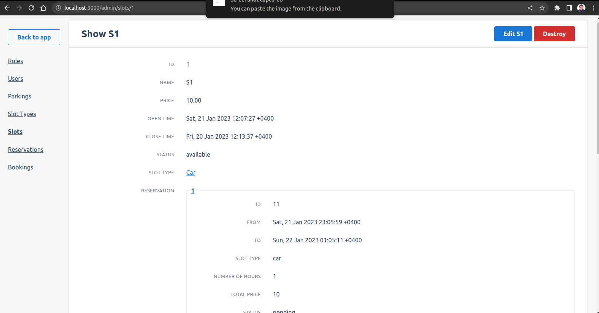
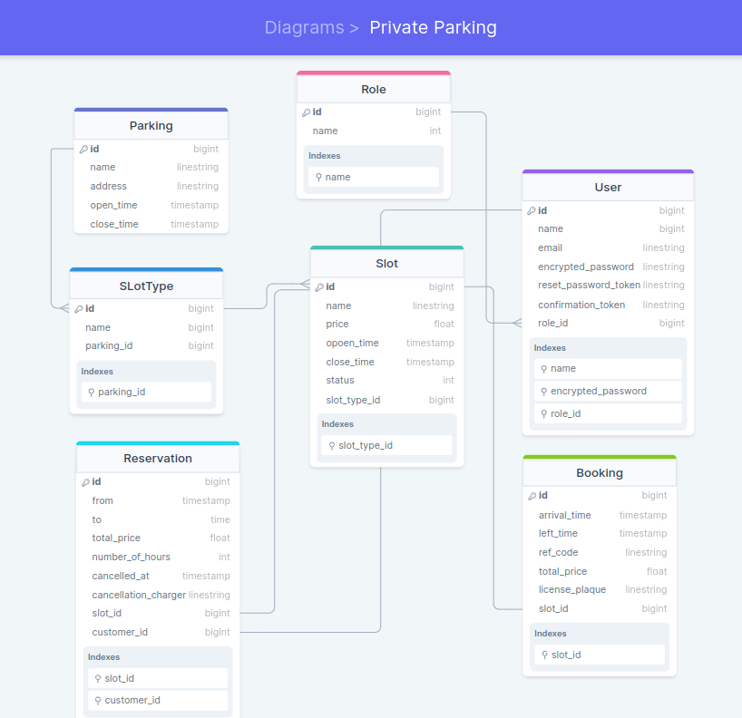

# PRIVATE PARKING

> The Admin Portal is a web-based application that allows administrators to manage and monitor the slots and reservations in a parking lot. The application includes the following features: This API is made these models:

  - Role Model
  - User Model
  - Parking Model
  - SlotType Model
  - Slot Model 
  - Reservation model 
  - Booking Model
  
### ADMIN Dashboard

### ERD PG

### User confirmation Mailer

### Message rendered from the backend 

### Deployment
 N/A `Kinldy i can't config my google SMTP because i using it to some of my projects that's why i did;\'nt deployed the app on heroku as well`
## Built With

- Rails
- Ruby 
- Postgresql
- Devise
- JWT
- ActiveRecord Serializer
- Sidekiq
- Redis
- Rswag

## Getting Started

Here are the steps to follow in order to get this project on your local computer.

### Prerequisites

`rails v7.0.2 +`

`ruby v3.0.2 +`

### Setup

clone this repo by typing `git clone https://github.com/vic778/`

### Install

install the dependencies by typing `bundle install`

### Usage

start the local server by running `rails s`

### Testing

run the tests by typing `rails rswag`

### Documentation

## Author

👤 **Victor Barh**

- GitHub: [@Vvic778](https://github.com/vic778)
- Twitter: [@victoirBarh](https://twitter.com/)
- LinkedIn: [LinkedIn](https://linkedin.com/in/victoir-barh)

## 🤝 Contributing

Contributions, issues and feature requests are welcome!

Feel free to check the [issues page](issues/).

## Show your support

Give a ⭐️ if you like this project!

## Acknowledgments

 N/A

## 📝 License

This project is [MIT](lic.url) licensed.
